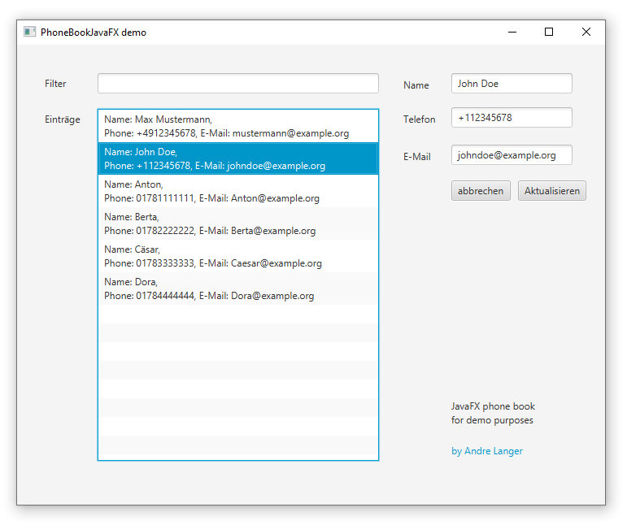

# PhoneBookDemoJavaFX

Phone book demo application in JavaFX by [Andre Langer](https://github.com/WebDeveloperALanger)

## About This Project

This simple demo project was crafted to teach JavaFX. By demonstrating my Java skills and software development best
practices, I hope it can serve as a useful resource for anyone interested in JavaFX. Feel free to explore, learn, and
enjoy!

## Connect With Me

I'm continually seeking fresh challenges and exciting opportunities.
If my skills and experiences caught your attention, and you think I might be a solid fit for your project or team,
I'd be thrilled to chat with you.

You can get in touch with me on  [LinkedIn](https://www.linkedin.com/in/andre-langer-web-developer)
or Twitter at [Twitter](https://twitter.com/ALangerWebDev).
I look forward to potential collaborations and engaging discussions!

## License

This project is under the permissive MIT License, granting broad permissions for reuse with minimal constraints. To
understand all the details, take a look at the [LICENSE.md](./LICENSE.md) file in this repository. Feel free to utilize
and learn from this project, while adhering to the license's terms and conditions.
